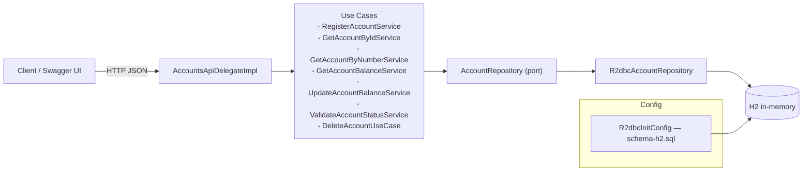

# Account V1 API

- Java 25 · Spring Boot 4 · WebFlux (reactive)
- OpenAPI Generator — delegate pattern
- R2DBC + H2 in-memory

---

## Architecture



---

## Run with Docker Compose

```bash
# 1. Clone
git clone https://github.com/vito-ivan/account-v1.git
cd account-v1

# 2. Build + run
docker compose up --build

# 3. Logs
docker compose logs -f

# 4. Stop
docker compose down
```

---

## API

| Resource     | URL                                                        |
|--------------|------------------------------------------------------------|
| Swagger UI   | http://localhost:8080/webjars/swagger-ui/index.html        |
| OpenAPI spec | `src/main/resources/openapi/api.yaml`                      |
| Health       | http://localhost:8080/actuator/health                      |

### Endpoints

| Method | Path                           | Description                        |
|--------|--------------------------------|------------------------------------|
| POST   | `/accounts`                    | Create a bank account              |
| GET    | `/accounts?accountNumber=`     | Get account by account number      |
| GET    | `/accounts/{accountId}`        | Get account by ID                  |
| GET    | `/accounts/{accountId}/balance`| Get account balance                |
| PUT    | `/accounts/{accountId}/balance`| Update account balance             |
| GET    | `/accounts/{accountId}/status` | Validate account status            |

---

## Tests

```bash
# Compile without tests
.\mvnw.cmd -DskipTests clean package

# Run tests
.\mvnw.cmd -DskipTests=false test
```